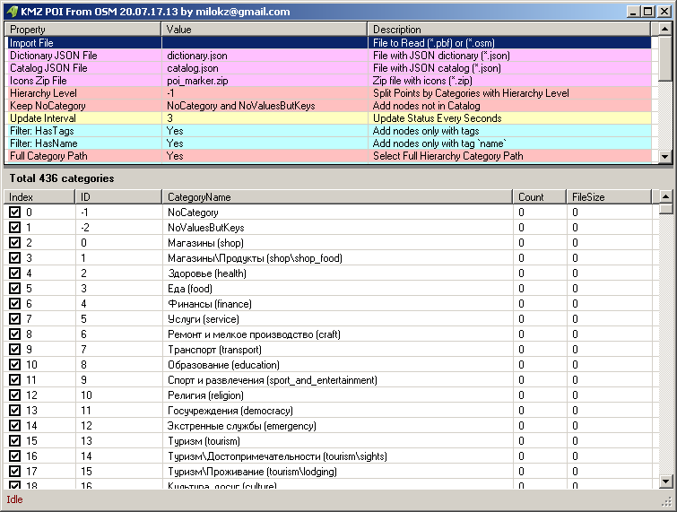

# KMZ POI from OSM
Create KMZ file from OSM or OSM POI file (converter)   

[KMZ Repository](https://github.com/dkxce/KMZ_FILES)     
[KMZ Репозиторий](https://github.com/dkxce/KMZ_FILES)     

Get OSM Map [bbike](https://extract.bbbike.org/), use:  Protocolbuffer (PBF) or MapsForge (OSM) file formats       
Получение данных OSM [bbike](https://extract.bbbike.org/), use:  Protocolbuffer (PBF) or MapsForge (OSM) file formats  

