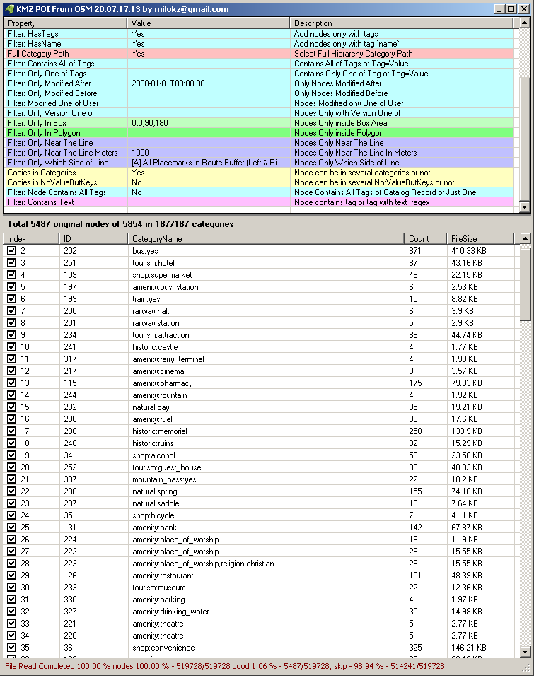
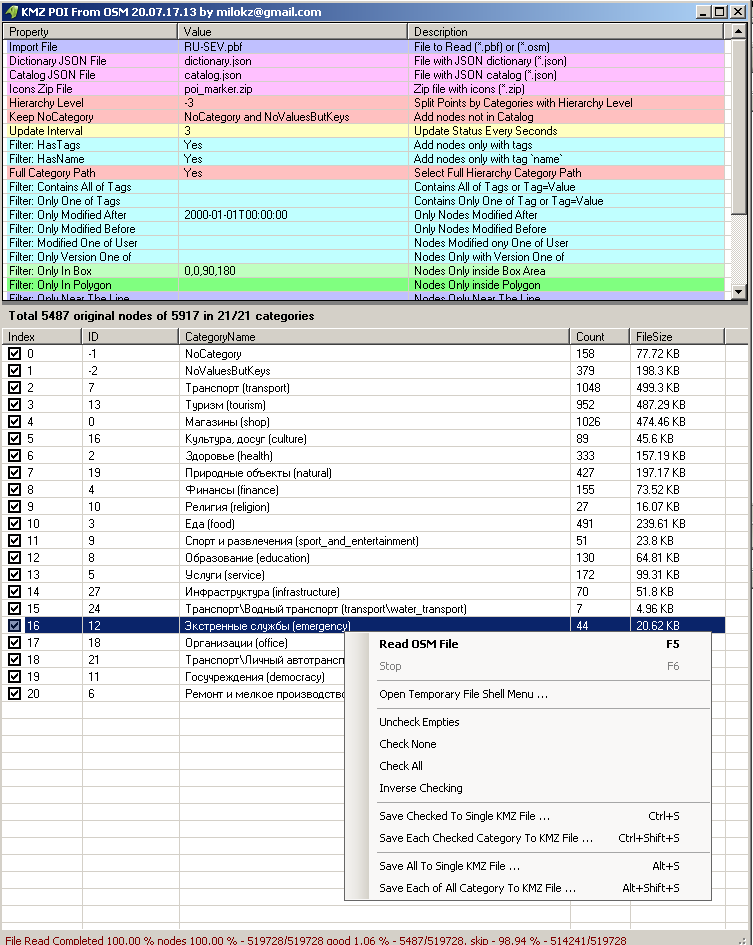

# KMZ POI from OSM
Create KMZ file from OSM or OSM POI file (converter)   

You can use result files in [Google MyMaps](https://www.google.com/maps/d/), [KMZRebuilder](https://github.com/dkxce/KMZRebuilder) and [KMZViewer](https://github.com/dkxce/KMZViewer)

### Get OpenStreetMap DATA - Данные OpenStreetMap

[OpenStreetMap](https://www.openstreetmap.org/export) - OSM        
[OSM Planet in PBF format](https://planet.openstreetmap.org/pbf/)     
[OSM Planet in OSM format](https://planet.openstreetmap.org/planet/)    
[GeoFabric PBF+OSM format](https://download.geofabrik.de/)    
[BBBike](https://extract.bbbike.org/), use:  Protocolbuffer (PBF) file format       
[BBBike Extracted](https://download.bbbike.org/osm/extract/), use:  Protocolbuffer (PBF) file format   

### KMZ

[KMZ Files Repository / Репозиторий KMZ файлов](https://github.com/dkxce/KMZ_FILES)     

